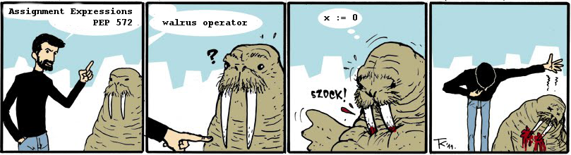

Touching a URL file-like way
===

> Changed in version 3.6:

> Support added to accept objects implementing os.PathLike.

```
import os, urllib.request


class P(os.PathLike):

    def __init__(self, source):
        super().__init__()
        self.source = source

    def __fspath__(self):
        file_name, *_ = urllib.request.urlretrieve(self.source)
        return file_name

with open(P('http://google.com')) as file:
    print(file.read())
```

SyntaxError: non-default argument follows default argument
===

```
>>> def func(a=1,*,b):print(a,b)
>>> func(b=0)
1 0
```

PEP 3105 -- Make print a function
===

```
$ python3 -c 'print (1)'
1
```

```
$ python2 -c 'print (1)'
1
```

`Ellipsis` from the standard types, placeholder-like singleton
===

usage:
* “nop” literal `def f(): ...`
* annotations `def f(x: ...) -> None: pass`
* extended slicing syntax for user-defined container data types, mostly in numpy `d[...] = 1`

(isn’t related to representations of the circular data structures like `x=[0]; x.append(x); print(x)`, and not related to `doctest.ELLIPSIS` marker too)

Supporting full Python expressions in f-strings
===

```
>>> one, two = 1, 2
>>> f'{one}, {two}'
'1, 2'
>>> f'Total: {one + two}'
'Total: 3'
>>> f'Items: {len((one, two))}'
'Items: 2'
```


Ternary op
===

```
>>> ('false', 'true')[True]
'true'
>>> ('false', 'true')[False]
'false'
>>> a=10
>>> ('false', 'true')[a>0]
'true'
```

`<cond>?<true>:<false>`, `<true> if <cond> else <false>`, `if <cond> and <true> or <false>` etc just a syntactic sugar for conditional expressions. Ternary operator can be simulated with binary map operation at tuple/list/array/hash literal expression in various programming languages. Sure, there is problem with readability and short-circuit evaluation (which can be solved)

```
(lambda: 'true', lambda: 'false')[::-1][a>0]()  # perl challenge accepted
```

Why ternary op. in C-like style [was rejected](https://www.python.org/dev/peps/pep-0308/#alternatives).

Raising exceptions in lambdas
===

```
r = lambda: (_ for _ in ()).throw(Exception('foobar'))

def raise_(ex):
    raise ex

r = lambda: raise_(Exception('foobar'))

r = lambda: 1/0

r = lambda: [][0]
```

`sudo boo`
===


[bo(o)](https://github.com/dmibaranov/boo "bo(o)").

Python 3.7 is out
===

```
$ echo "breakpoint(); print('done')" > bugs.py
$ python bugs.py
done
--Return--
> /bugs.py(1)<module>()->None
-> breakpoint(); print('done')
(Pdb) c
$ PYTHONBREAKPOINT=print python bugs.py # staging env

done
$ PYTHONBREAKPOINT=0 python bugs.py # production env
done
$ PYTHONBREAKPOINT=exit python bugs.py #happy debugging!
$

```

Tomorrow
===

```
import datetime, time
def get_tomorrow_date():
    time.sleep(60 * 60 * 24)
    return datetime.date.today()
```

py-spy allows simple inspection without relaunch of process (any python versions)
===

How to profile container w/o installed py-spy:

```
$ docker ps
# our process inside of blah-blah-d7f807e6 container
# running new container for profiling (with enabled PTRACE) which joins to our container's namespace; installing py-spy
$ docker pull python:2.7-jessie && docker run -it --pid=container:blah-blah-d7f807e6 --rm --privileged --cap-add SYS_PTRACE python:2.7-jessie sh -c 'pip install py-spy && bash'

# in container
$ ps aux | grep python | awk '{print $2 " " $11}'
$ py-spy --pid PYTHON_PROCESS_PID
$ exit

# at host, cleanup
$ docker rmi python:2.7-jessie
```

Chicken or the egg, finally
===

```
print(sorted(('🥚', '🐔'))[0])
🐔
```

PEP 572
===


